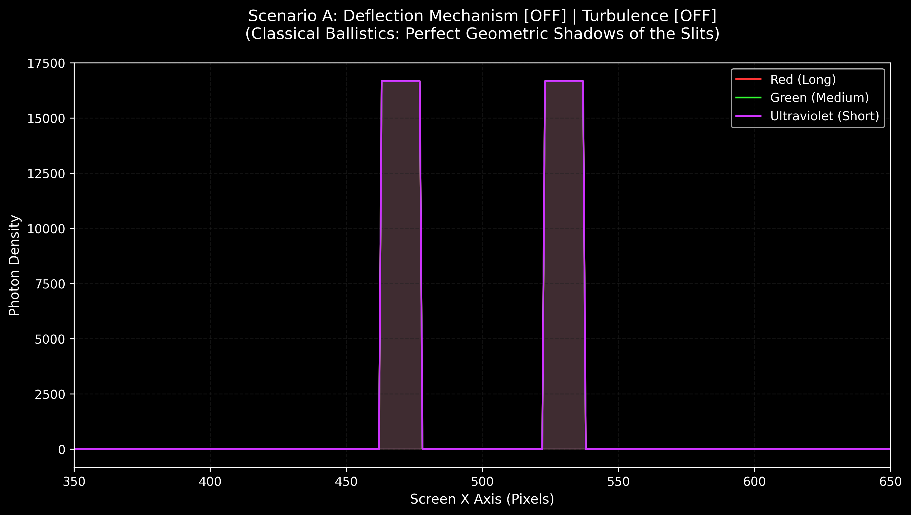
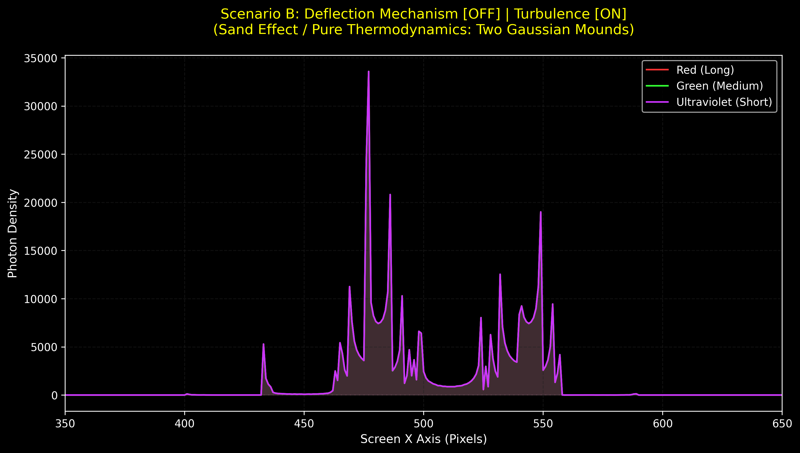
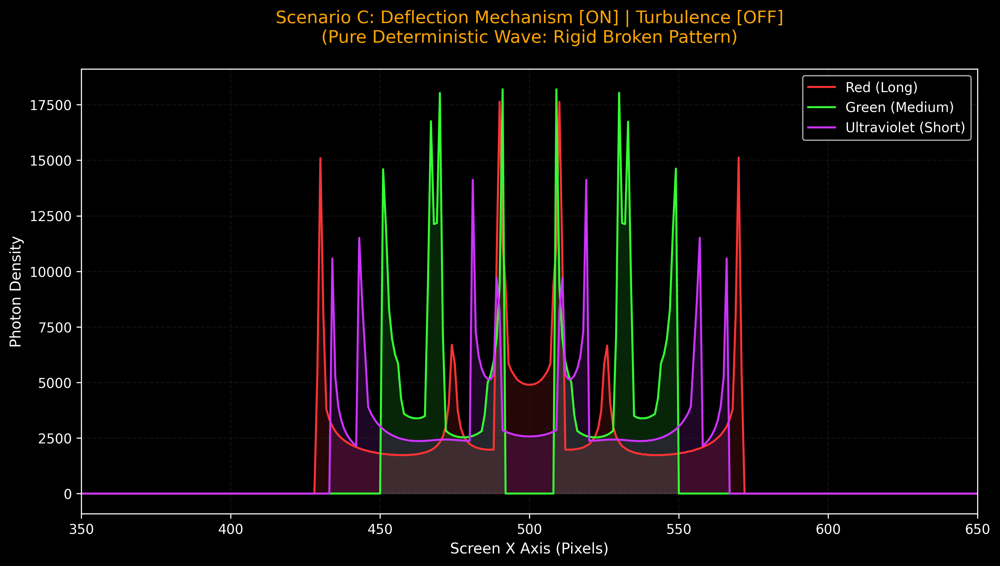
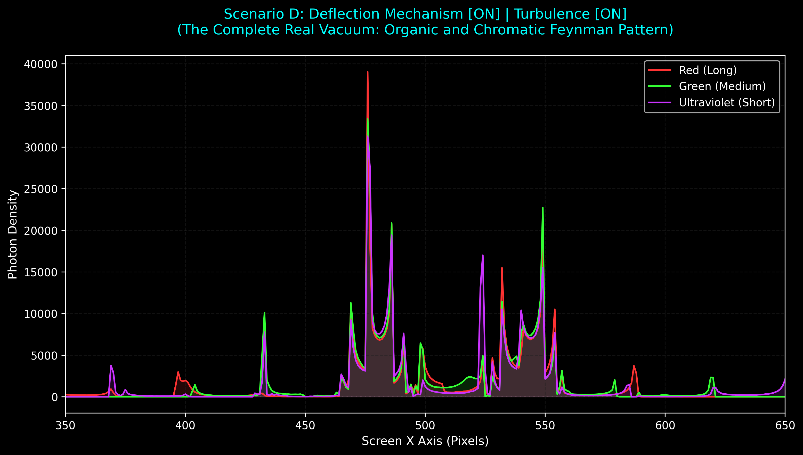
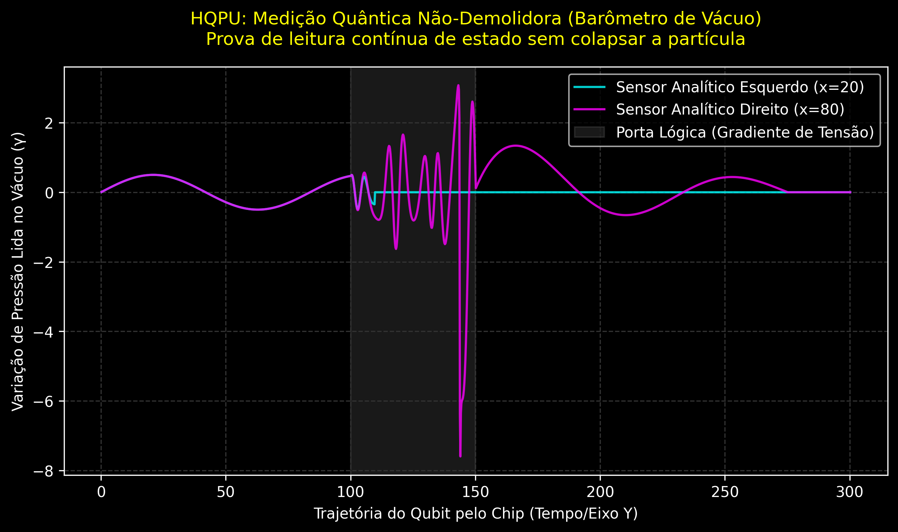

# Deterministic Wave Engine (DWE)
## A Hydrodynamic Computational Model of Wave-Particle Duality

This repository contains a high-performance computational Proof of Concept (PoC) demonstrating that the classical quantum interference pattern (the Feynman Double Slit experiment) can be replicated deterministically.

By modeling the vacuum not as empty space, but as a fluid medium with structural tension and vortex memory, this engine proves that photons can be treated as classical corpuscles. The wave-like behavior emerges purely from hydrodynamic pressure gradients and the thermodynamic turbulence left in the vacuum by previous interactions. There is no need for wavefunction collapse or probabilistic dice-rolling.

---

## 🔬 The 4-Quadrant Matrix: Isolating the Variables

To prove the mechanics of the engine, we isolate the two fundamental forces acting on the particle:
1. **The Deflection Mechanism:** The geometric pressure gradient created by the physical slits (macro-structure).
2. **The Vacuum Turbulence:** The microscopic vortex wakes (memory) left in the fluid medium by traveling particles.

By toggling these forces ON and OFF, the engine generates four distinct physical universes.

### Scenario A: The Newtonian World (Deflection OFF | Turbulence OFF)
When particles are fired into a completely static, non-resistant vacuum, they behave as classical ballistic projectiles (like lead bullets).
* **Result:** The engine produces perfect geometric shadows of the two slits. Particles travel in absolute straight lines, forming two rigid, rectangular blocks on the screen.



### Scenario B: The Sand Dispersion (Deflection OFF | Turbulence ON)
If we introduce vortex turbulence (a trembling medium) but remove the wave-field geometry, the rigid rectangles melt.
* **Result:** The particles scatter statistically, creating two overlapping Gaussian distributions (bell curves). This perfectly mimics the thermodynamic behavior of dropping sand or pollen through two funnels. No interference fringes appear.



### Scenario C: Rigid Interference (Deflection ON | Turbulence OFF)
When the hydrodynamic pressure gradient of the slits is applied to a frozen, turbulence-free vacuum, tgithe mathematical skeleton of interference emerges.
* **Result:** The pressure gradient forces particles into specific channels of least resistance, creating interference macro-fringes. However, due to the discrete nature of the particles and the rigid deterministic math, the pattern is broken and sterile—forming a sharp "comb" of impacts with empty gaps between them.



### Scenario D: Fluid Reality (Deflection ON | Turbulence ON)
The complete hydrodynamic model. The structural geometry of the field provides the "traffic rules" (Scenario C), while the thermodynamic turbulence of the vortex wakes provides the organic fluidity (Scenario B).
* **Result:** The engine generates the authentic, continuous Feynman Interference Pattern. The rigid comb is smoothed into a continuous wave. Furthermore, particles with different vortex diameters (wavelengths) suffer different lateral drag, perfectly reproducing the chromatic dispersion (rainbow halos) observed in real-world sunlight experiments.



---

## ⚙️ Core Mechanics: How the Engine Works

The Deterministic Wave Engine is written in **Rust** (for high-performance, contiguous-memory multithreading) and uses **Python** for data visualization. It operates on two foundational postulations:

### 1. Huygens' Deflection (The Wave Structure)
The slits act as physical wave sources that tension the vacuum fluid. As the photon exits the slit, it reads the local pressure gradient of the medium. The lateral force ($F_x$) pushing the photon is calculated using the partial derivative of the wave phase:

$$\text{Phase} = k \cdot d - \omega \cdot t$$

The engine calculates the sum of these pressure gradients, forcing the photon away from high-resistance zones (destructive interference) and into low-resistance channels (constructive interference).

### 2. The Vortex Wake (The Fluid Memory)
A true fluid is not rigid. A moving body leaves a wake of vortices behind it. The engine simulates this "vacuum memory" by applying a microscopic, position-based fluctuation to the photon's lateral velocity. This deterministic turbulence organically spreads the particle trajectories, filling the discrete aliasing gaps and smoothing the statistical data into a classical continuous wave.

---

## 🚀 Running the Engine

### Prerequisites
* Rust and Cargo installed.
* Python 3 installed with `matplotlib`.

### Execution
1. Clone the repository and navigate to the project folder.
2. Run the Rust hydrodynamic engine. This will calculate the trajectories for millions of photons and generate four `.csv` files corresponding to the 4-Quadrant Matrix:
   ```bash
   cargo run --release
```
Generate the analytical plots using the Python visualizer:

```bash
python plot_quadrants.py
The four PNG charts will be saved in your root directory.
```
---
## 📜 Historical and Philosophical Implications: Rehabilitating Einstein's Local Realism

The development of the *Deterministic Wave Engine* transcends mere computational modeling; it addresses the deepest schism in modern physics: the battle between the **Copenhagen Interpretation** (Bohr, Heisenberg) and **Local Realism** (Einstein, De Broglie, Schrödinger).

### 1. "God Does Not Play Dice" (*Gott würfelt nicht*)
In 1926, Albert Einstein famously wrote to Max Born expressing his fundamental rejection of quantum mechanics' intrinsic randomness: *"The theory yields a lot, but it brings us hardly any closer to the secret of the Old One. In any case, I am convinced that He does not throw dice."*

For nearly a century, the physics mainstream treated Einstein's stance as an outdated stubbornness, arguing that the double-slit experiment forced the acceptance of a probabilistic universe where particles exist as ghosts until an observer "collapsed" their wavefunction.

**DWE fundamentally rehabilitates Einstein's intuition.** The engine demonstrates that what Copenhagen interprets as *intrinsic quantum probability* ($\Psi^2$) is actually the **spatial density distribution ($\rho$) of purely classical corpuscles guided by a non-linear hydrodynamic medium**. 
* The randomness is an illusion born of scale. 
* In **Scenario B**, we see that the "trembling" of the medium acts as the ultimate **Hidden Variable**—a deterministic, highly chaotic vortex network left behind by previous matter interactions. 
* The universe does not roll dice; rather, we have failed to model the fluid dynamics of the table upon which the dice are rolled.

### 2. Demystifying the Measurement Problem
One of the most mystical pillars of standard quantum mechanics is the "Measurement Problem"—the claim that a particle "knows" it is being watched, shifting from a wave to a particle pattern upon detection.

Under this hydrodynamic model, this mystery evaporates into classical mechanics:
* To measure or detect which slit a photon passes through, an observer must introduce a physical mechanism (a sensor, an electromagnetic field, or a barrier) at the slit's opening.
* In a fluid vacuum possessing **Base Spatial Tension ($\gamma$)**, introducing a detector alters the boundary conditions or absorbs the localized wave propagation.
* By disrupting the fluid medium at one slit, the symmetric, overlapping pressure gradient (Scenario C) is mechanically broken.
* Deprived of the structured gradient cross-fire, subsequent photons no longer have "constructive highways" to follow. The pattern collapses not due to the presence of a "conscious mind," but due to the brute-force mechanical interference of the detector on the sub-spatial medium.

### 3. Giving Substance to the Pilot Wave
Louis de Broglie and later David Bohm proposed the *Pilot Wave Theory*, suggesting that physical particles are real and are guided along trajectories by a "sub-quantum" wave. However, their equations lacked a tangible physical substrate, leading the physics community to reject the pilot wave as an unneeded, abstract mathematical ghost.

DWE bridges this gap by replacing abstract "quantum potentials" with **Navier-Stokes-like fluid mechanics applied to the fabric of space**. The wave guiding the particle is a real, physical pressure wave propagating through a viscoelastic spatial ocean. By adding a finite relaxation rate and thermodynamic vortex memory (Scenario D), the rigid, unphysical "comb" of pure wave math is smoothed into the fluid reality observed in the laboratory.

---
---
-

## 💻 Applied Technology: The Hydro-Quantum Processing Unit (HQPU)

The theoretical framework of the *Deterministic Wave Engine* (DWE) extends beyond philosophy; it provides the mechanical blueprint for a new paradigm in quantum computing hardware. By replacing the statistical fragility of the Copenhagen Interpretation with non-linear fluid dynamics, we can redesign the quantum computer not as a probability matrix, but as an **Acoustic/Hydrodynamic Routing Architecture**.

We propose the theoretical foundation for the **Hydro-Quantum Processing Unit (HQPU)**, characterized by four mechanical pillars:

### 1. The Physical Qubit: The Vortex Resonator
Current quantum computers (e.g., superconducting transmons) rely on maintaining a fragile probabilistic superposition. In the HQPU framework, a qubit is not a statistical ghost; it is a **stabilized cavitation bubble or fluidic vortex** within the vacuum medium. 
* **Encoding:** Information is deterministically encoded in the physical state of the vortex—specifically, its rotational frequency ($\omega$) and the amplitude of its hydrodynamic wake. 
* **Advantage:** Because it is a classical deterministic state, it does not inherently require extreme cryogenic freezing to "pause" probability; it solely requires thermodynamic isolation from background vacuum turbulence.

### 2. Topological Logic Gates: Hydrodynamic Routing
Standard quantum gates use microwave pulses to induce probability shifts. In an HQPU, logic gates are literal physical or electromagnetic modulations of the **Base Spatial Tension ($\gamma$)** across the chip.
* **Mechanics:** The gates act as nanoscale breakwaters or irrigation channels. As the vortex-qubit travels through the processor, it encounters these artificial pressure gradients. Governed by Huygens' Principle, the qubit is passively guided through the paths of least resistance. Complex quantum operations (like Hadamard or CNOT gates) become topological cross-currents of fluid pressure.

### 3. Non-Demolition Measurement: The Analytical Receiver
The greatest bottleneck in modern quantum computing is the destructive nature of measurement (wavefunction collapse). The DWE model resolves this by separating the corpuscle from its wave. The particle travels forward, but its movement agitates the $\gamma$ medium, leaving behind a **Thermodynamic Vortex Wake**.
* **The Vacuum Barometer:** Instead of intercepting the particle with a photoelectric detector, the HQPU utilizes *Analytical Receivers* aligned parallel to the propagation channel. These act as nanoscale barometers, performing **Weak Measurements**. They solely read the lateral pressure differential (the wake) left by the qubit. 
* **Real-Time Feedback:** By reading the wake rather than the particle, the system extracts the computational result (the frequency/state) while the original vortex continues its trajectory physically intact. This enables continuous, real-time feedback loops during a computation without resetting the system. 


*(Note: The `hqpu.rs` binary in this repository provides the computational proof of this continuous, non-destructive reading, as visualized in the graph above).*

### 4. Redefining Decoherence and Error Correction
Currently, quantum processors require massive redundancy (thousands of physical qubits to sustain one logical qubit) to combat "decoherence." Standard physics views decoherence as inevitable quantum noise caused by the universe observing the system.
* **The Fluidic Diagnosis:** Under the DWE model, decoherence is simply **Thermodynamic Leakage**. It is the turbulence of the external vacuum (the "Sand Dispersion" effect) leaking into the processor and disrupting the clean pressure gradients.
* **The Engineering Solution:** Error correction in an HQPU shifts from algorithmic redundancy to **hardware damping**. The architecture focuses on creating an "anechoic chamber" for the spatial fabric—using metamaterials to smooth the local $\gamma$ tension, acting as a physical breakwater against external vacuum turbulence.

---

### 5. Experimental Precedents: The Reality of Non-Demolition
The concept of an "Analytical Receiver" reading the vacuum wake without destroying the particle is not science fiction; it has already been proven in laboratory settings under the terminology of **Quantum Non-Demolition (QND) Measurements**.

* **The 2012 Nobel Prize (Serge Haroche):** Haroche successfully trapped a single photon in a microwave cavity and measured its state without destroying it. He fired Rydberg atoms across the cavity, which did not collide with the photon, but merely read the phase shift (the "wake" in our fluid model) left by the photon's presence.
* **Superconducting Qubits (IBM/Google):** Modern quantum chips already utilize this parallel reading architecture. They use "Readout Resonators"—parallel microwave tracks that do not physically intersect the qubit. They read the state by measuring the subtle frequency shift in the local space (the $\gamma$ tension fluctuation) caused by the qubit's operation. 

**The DWE Contribution:** While standard physics explains these feats using abstract Hamiltonian operators and phase entanglement, the DWE framework is the first to provide the **mechanical, hydrodynamic "why"** behind these successful experiments.
---

# 📄 License

This project is licensed under the Apache License 2.0.

You may obtain a copy of the license at:

- https://www.apache.org/licenses/LICENSE-2.0

Copyright © Fernando B. Couto

Licensed under the Apache License, Version 2.0 (the "License");
you may not use this project except in compliance with the License.
You may obtain a copy of the License at:

http://www.apache.org/licenses/LICENSE-2.0

Unless required by applicable law or agreed to in writing, software
distributed under the License is distributed on an "AS IS" BASIS,
WITHOUT WARRANTIES OR CONDITIONS OF ANY KIND, either express or implied.
See the License for the specific language governing permissions and
limitations under the License.
