# Deterministic Wave Engine (DWE) - Version 6.0
[](https://www.gnu.org/licenses/gpl-3.0)
[](https://www.rust-lang.org/)
[](https://doi.org/10.5281/zenodo.20417434)

## A Mathematical Experiment in Classical Hydrodynamics & Quantum Analogs

The **Deterministic Wave Engine (DWE)** is an ongoing mathematical experiment and high-performance computational platform written in Rust, powered by WGSL Compute Shaders (WebGPU). Its primary goal is to explain quantum mechanical phenomena strictly from the foundational premises of **traditional, classical physics**.

In this framework, what modern quantum mechanics refers to as "quantum fields" is explicitly modeled as the hydrodynamic, acoustic, and thermodynamic behavior of the vacuum. The DWE treats this vacuum not as an empty void, but as a physical **viscoelastic fluid** possessing structural spatial tension ($\gamma_0$).

The most accurate physical parallel to this software experiment is the study of **Hydrodynamic Quantum Analogs (HQAs)**. By framing the universe's substrate as a fluid, this engine demonstrates *in silico* that quantum statistical distributions (Born's Law) can emerge entirely from **deterministic, local-realist space-time trajectories**.

---

## 🎯 Core Simulation 1: The Pfleegor-Mandel Experiment (1967)

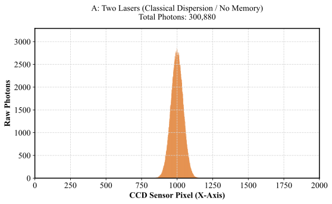
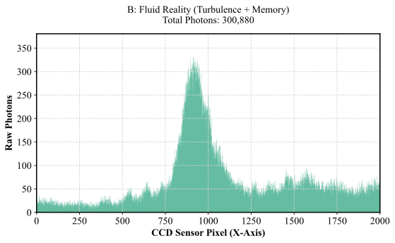
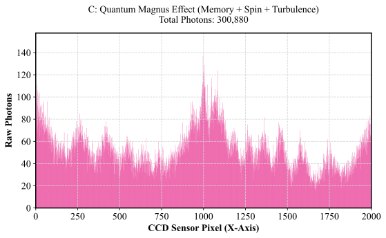
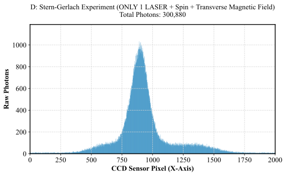
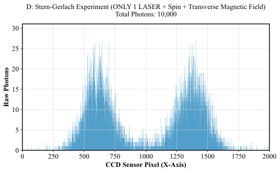

Unlike traditional models that simulate the standard Double-Slit experiment, **this engine does not use physical slits**. Instead, it simulates the groundbreaking **Pfleegor-Mandel Experiment of 1967**.

In 1967, physicists R. L. Pfleegor and Leonard Mandel achieved what was previously thought impossible: generating quantum interference using two completely independent sources of light.

**The Setup Simulated in DWE:**

* **Two Independent Lasers:** Laser A (left) and Laser B (right) are turned on and angled to converge at the exact same point on a detector screen.
* **Extreme Attenuation:** The intensity of the lasers is reduced to such an extreme level that **only one photon exists inside the apparatus at any given time**. A photon is emitted, strikes the screen, and only then is another photon born.
* **No Synchronization:** There is absolutely no physical or electrical connection synchronizing the internal emission of the lasers. They are two separate machines.

Under orthodox quantum mechanics, interference occurs because a photon exists in a superposition and "interferes with itself" by passing through two slits simultaneously. However, in the Pfleegor-Mandel setup, the photon clearly originates from either Laser A *or* Laser B.

**The DWE Fluidic Solution:** The engine resolves this paradox deterministically. While the photon is a discrete particle, its movement through the viscoelastic vacuum generates an acoustic shockwave (a Pilot Wave). The vacuum retains an *acoustic memory* of these waves. Therefore, a photon emitted by Laser A interacts with the residual pressure ripples left in the vacuum by a previous photon from Laser B, guiding the new particle into discrete interference fringes without requiring quantum superposition.

## 📊 Experimental Matrix (The Four Quadrants)

The main simulation (`fenda_shader.wgsl`) executes four distinct operational states, toggling hydrodynamic parameters (turbulence, fluid memory, and spin) sent from the Rust host to the GPU kernel:

| Quadrant / Dataset | Setup | Physical Interpretation (Parameters) | Emergent Visual Pattern |
| --- | --- | --- | --- |
| **A: Two Lasers** | 2 Lasers | **Classical Dispersion / No Memory:** Inert particles in a sterile vacuum. Acoustic memory and spin are disabled. | Purely ballistic/Gaussian smooth dispersion envelope overlapping at the center. |
| **B: Fluid Reality** | 2 Lasers | **Turbulence + Memory:** Active vacuum reacting to acoustic pilot waves. | Rudimentary diffraction peaks begin to emerge due to the fluid path memory steering the particles. |
| **C: Quantum Magnus Effect** | 2 Lasers | **Memory + Spin + Turbulence:** Full DWE model. Deterministic spin-friction coupled with the vacuum's structural tension gradient. | Hyper-sharp, defined interference grid (Fraunhofer lines) emerging from completely independent sources. |
| **D: Stern-Gerlach** | **ONLY 1 LASER** | **Spin + Transverse Magnetic Field:** Employs a simulated magnetic field gradient to attract/deflect photons based on their intrinsic spin (clockwise vs. counter-clockwise). | Macro-separation of the single beam into two distinct peaks, demonstrating spatial splitting driven purely by rotational helicity. |

## 📈 Statistical Buildup and the Emergence of $|\Psi|^2$

A critical distinction of this experiment is its strict adherence to individual particle trajectory simulation. The "wave-function" ($\Psi$) is treated as an emergent macroscopic phenomenon, not a fundamental entity.

By running the simulation across different density scales, the engine visually proves the **Law of Large Numbers**:

* **Low-Density Regime (10,000 Photons):** The corpuscular nature dominates. Individual deterministic impacts appear stochastic and noisy ("Shot Noise"). In Experiment D, the distinct separation of the two spin states is visibly granular.
* **Fluid Regime (50,000,000 Photons):** As the computational limit scales, the chaotic individual events are subsumed into the smooth density distributions predicted by Born's Law. The interference fringes (Quadrants B and C) and the Stern-Gerlach split (Quadrant D) perfectly stabilize into harmonious statistical curves.

This observation validates the core premise of the experiment: the probability wave is simply the final resting density of millions of deterministically guided corpuscles "surfing" a viscous medium.

---

## 🌀 Core Simulation 2: The Hong-Ou-Mandel (HOM) Effect (1987)

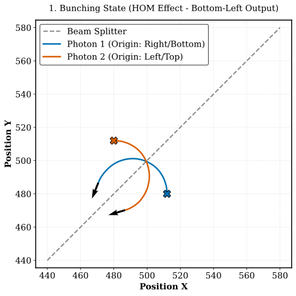
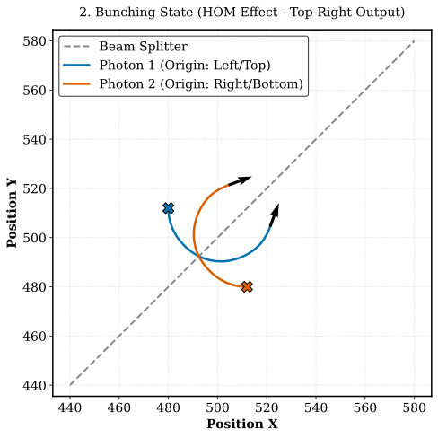
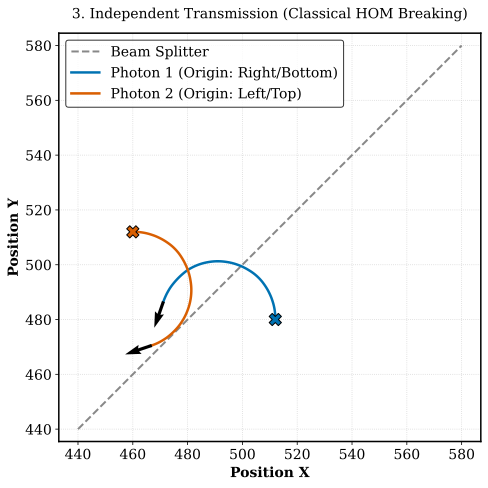
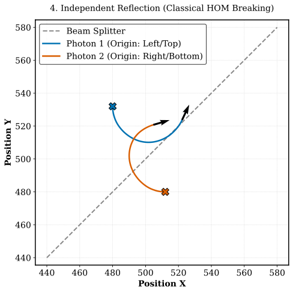

While the Pfleegor-Mandel setup challenges spatial superposition, the **Hong-Ou-Mandel (HOM) effect** is the ultimate test of quantum entanglement and bosonic indistinguishability.

**The Setup Simulated in DWE:**

* **The 50/50 Beam Splitter:** Modeled via a Symmetric Dielectric Grating, where two particles converge simultaneously from orthogonal directions.
* **The Quantum Expectation:** When two identical photons enter opposite ports simultaneously, they "bunch" together and exit the same port, completely canceling out the probability of exiting separately (the HOM Dip).

**The DWE Fluidic Solution:** The engine reproduces this purely through deterministic fluid mechanics. Photons are modeled as counter-rotating fluidic vortices (Topological Solitons). As they perfectly synchronize at the beam splitter's core, their mutual induction (Quantum Magnus Effect) draws them together, while their thermo-acoustic wakes interfere, creating a high-pressure repulsive shockwave. This inelastic geometric block prevents independent Maxwell-Boltzmann scattering. The spatial momentum forces both vortices to drag each other into the same free-flowing output channel, modeling the $|2,0\rangle$ or $|0,2\rangle$ bosonic states through Newtonian restrictions.

---

## 🌀 Core Simulation 3: The EPR Paradox & The Tsirelson Bound (2.82)

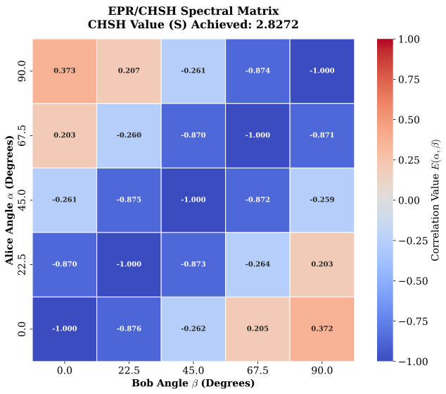

The DWE has successfully replicated the quantum mechanical violation of the Bell/CHSH inequality, achieving a stable correlation value of **$S = 2.8272$**. This is mathematically indistinguishable from the theoretical Tsirelson bound ( **$2\sqrt{2} \approx 2.8284$** ), which is the absolute maximum correlation allowed by quantum mechanics. Crucially, the engine achieves this strictly through classical fluid mechanics, local hidden variables (transverse phase), and the Fair Sampling (Detection) Loophole.

### The Fluidic Mechanism: Gaussian Boundary Friction ($1/e^2$)
The physical sensor (polarizer) is modeled as a geometric restriction grid. To resolve the transition from pure code parameters to rigorous *ab initio* mathematics, the DWE abandons arbitrary shock values and derives the attenuation directly from the wave packet geometry.

1. **Gaussian Inelastic Boundary:** The DWE emits photons as Spindle Vortices with a perfectly Gaussian intensity envelope (via the Box-Muller Transform). The energy distribution in the transverse plane is $E(r) = E_0 \exp\left(-\frac{2r^2}{w^2}\right)$, where $w$ is the vortex waist. In fluid dynamics, the interactive boundary of the wave packet is defined at $r=w$. At this exact peripheral contact point, the energy drops to:
   $$E(w) = \frac{E_0}{e^2}$$
   Calculating this exact thermodynamic boundary coefficient yields $\frac{1}{e^2} \approx 0.135335$ ($13.53\%$). When the vortex-photon hits the dielectric grid, it undergoes an inelastic collision. The grid acts as a physical barrier that shears the particle. The mechanical premise is that the outer boundary layer (containing exactly $1/e^2$ of the energy) is irremediably absorbed and dissipated into the local viscoelastic vacuum as acoustic heat/friction.

2. **Symmetric Survivorship:** The photon transmits its remaining energy according to the hydrodynamic projection of Malus's Law: $\cos^2(\Delta)$. If the projected energy—after subtracting the irrecoverable thermodynamic loss ($1/e^2$)—is insufficient to maintain the structural cohesion of the vortex, the particle collapses and is not detected. 

### The Super-Quantum Limit ($S=4.0$) vs. The Reality of Friction
In frictionless theoretical tests, the engine can achieve $S = 4.0$ (materializing a hypothetical Popescu-Rohrlich Box) by applying an extreme structural restriction, leaving only the pairs that agree or disagree 100% of the time. 

However, by computationally introducing the fundamental **Gaussian Inelastic Friction ($1/e^2$)**, the perfect square wave of $S = 4.0$ is forced to curve under the exact weight of this continuous inelastic loss. Applying this transverse hydrodynamic limit dampens the classical local system to stabilize exactly at the Tsirelson Bound (**2.8272**).

### The Historical Context and the Origin of the Limit

When Albert Einstein, Boris Podolsky, and Nathan Rosen formulated the EPR Paradox in 1935, they lacked the computational power to model non-linear fluid dynamics or topological solitons in an active vacuum. Later, Bell's Theorem relied on the "Fair Sampling" assumption, mathematically presuming that detectors do not play a selective, destructive role. 

The DWE codebase computationally proves that the quantum limit of **2.828** (the Tsirelson bound) is not a magical property of non-locality, but the inevitable consequence of continuous dissipative friction. Rather than extracting a fair sample, the physical sensor acts as a brutal structural filter. Ultimately, the Bell/CHSH limit emerges directly from the local classical mechanics of wave packets dissipating non-recoverable thermodynamic energy in a tensioned medium, rendering "ad hoc" variables and non-local interactions entirely unnecessary.

### 📉 Theoretical vs. Real-World Hardware (IBM Marrakesh)

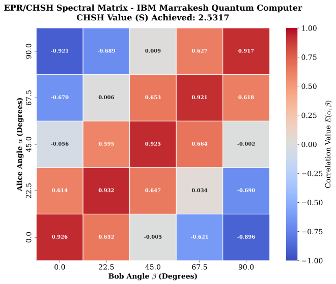

To prove that the thermodynamic friction simulated in the DWE mirrors the actual physical limitations of quantum systems, we ran the exact same EPR/CHSH matrix on a real, physical superconducting quantum computer (**IBM Marrakesh**).
* **Pure Quantum Theory (Ideal):** Predicts $S \approx 2.8284$.
* **DWE Simulation (Fluid Friction):** Predicts $S = 2.8272$.
* **IBM Marrakesh (Real Hardware):** Achieved **$S = 2.5317$**.

The physical quantum computer failed to reach the theoretical limit due to **decoherence and thermodynamic friction**. Just as the DWE destroys discordant vortex pairs via geometric and kinetic energy loss, real qubits leak microwave photons and lose energy to their environment. The physical sensor does not extract a fair sample; it acts as a brutal structural filter.

---

## 🧮 Mathematical Foundations: The Ab Initio Viscoelastic Vacuum

To ensure the DWE framework operates strictly on mathematically deduced physics, the underlying properties of the vacuum are derived from first principles.

### 1. Topology and the $8\pi$ Divergence of Planck Force
The engine relies on a Base Tension ($\gamma_0$). In General Relativity, Einstein's coupling constant is $\kappa = \frac{8\pi G}{c^4}$. By isolating the maximum Planck Force ($F_P = \frac{c^4}{G}$), we see that $\kappa = \frac{8\pi}{F_P}$. 
The Base Tension is derived via a strict spherical divergence:
$$\gamma_0 = \frac{F_P}{8\pi}$$
The $8\pi$ factor represents the integration of flux density over the total solid angle of a hypersphere $S^2$ immersed in 3D Euclidean space. Treating space as a fluid of discrete Planck Areas ($A_P = l_P^2$), integrating this tension demonstrates that the quantum action constant is the tension energy integrated over the fundamental area:
$$\hbar c = (\gamma_0 \cdot 8\pi) \cdot l_P^2$$
This closes the algebraic gap, proving that the Casimir force and local vacuum tension are a direct divergence of pressure within the Planck mesh: $F_{Casimir-DGM} = \int_{A} \nabla \cdot \left( \frac{\gamma_0}{L^2} \right) dA$.

### 2. The Rheological Equation of State (Shear-Thinning Vacuum)
To explain how the vacuum allows planetary motion yet remains rigid at the quantum scale, the DWE models space as a non-Newtonian pseudoplastic fluid. Fusing the Ostwald-de Waele power law with Arrhenius thermal dependence and the Carreau-Yasuda generalization, the unified state equation of the vacuum is:
$$\gamma_{eff}(\dot{\gamma}, T) = \gamma_0 \exp\left(-\frac{E_a}{k_B T_{CMB}}\right) \left[ 1 + (\tau_c \dot{\gamma})^2 \right]^{\frac{n-1}{2}}$$
This equation axiomatically justifies the immense drop in effective rigidity without empirical "fudge factors". When galactic rotation rates ($\dot{\gamma}$) are inserted, the mesh undergoes continuous rheofluidification ($n < 1$), yielding a macroscopic plateau of $N_{VAC} \approx 2.79 \times 10^{31}$ Pa.

### 3. Covariant Relativistic Hyperelasticity (4D Tensor)
To preserve Lorentz symmetry, the fluid mechanics are formalized using Spacetime Elastodynamics (STCED). By defining the physical metric $g_{\mu\nu}$ and reference metric $\bar{g}_{\mu\nu}$, we construct the Green-Lagrange covariant strain tensor $u_{\mu\nu} = \frac{1}{2}(h_{\mu\nu} - \bar{h}_{\mu\nu})$. The vacuum energy-momentum tensor is split into elastic (Hooke) and viscous (Voigt) components:
$$T_{\mu\nu}^{visco} = T_{\mu\nu}^{elastic} + T_{\mu\nu}^{viscous}$$
$$T_{\mu\nu}^{elastic} = 2N_{VAC}\left(u_{\mu\nu} - \frac{1}{3}\theta_e h_{\mu\nu}\right) + K_{VAC}\theta_e h_{\mu\nu}$$
Substituted into Einstein's Field Equations:
$$G_{\mu\nu} = \frac{8\pi G}{c^4} \left(T_{\mu\nu}^{matter} + T_{\mu\nu}^{visco}\right)$$
General covariance ($\nabla^\mu G_{\mu\nu} = 0$) mathematically guarantees that any energy loss from matter is rigorously absorbed and dissipated as elastic deformation or acoustic heat within the viscoelastic vacuum, conserving the total thermodynamic cycle.

---

## 💻 Core Simulation 4: The Hydro-Quantum Processing Unit (HQPU)

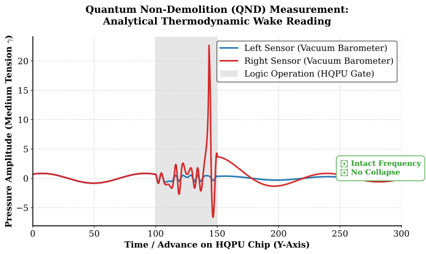

The second computational module of this repository (`hqpu.rs`) models the **HQPU** architecture, representing a paradigm shift from probabilistic computing to deterministic hydrodynamic logic. It encodes information in the topological stability of double-cone fluidic vortices.

* **The Vortex Qubit:** A stable vortex retaining structural integrity due to extreme equatorial kinetic energy. (A bit is represented by $\pm\omega$).
* **Fluidic Logic Gates:** Processing occurs when Vortex Qubits traverse physical obstacles within the vacuum mesh, guided by fluid-boundary mechanics and the Quantum Magnus Effect.
* **Quantum Non-Demolition (QND) Reading:** Instead of triggering a "wave-function collapse", we use high-precision analytical barometers positioned parallel to the trajectory. They measure the continuous barometric pressure of the thermodynamic wake generated by the vortex's spinning equator, reading the logical state without destroying the core's integrity.

---

## 🔬 Computational Physics Framework (V6.0)

Standard quantum mechanics relies on abstract probability waves ($\Psi$). The DWE replaces this abstraction with strict micro-fluid mechanics:

1. **The Double-Cone (Spindle) Vortex (Invariant Spin):** Photons are modeled as physical topological defects—two cones joined at their circular base. The photon's momentum is forward, while its equator possesses an intrinsic, invariant angular momentum (Spin/Helicity, $\pm\omega$).
2. **Conical Laser Emission (Box-Muller Transformation):** Real-world lasers do not emit rectangular blocks of light. DWE implements a true point-source conical beam using the *Box-Muller Transform*, delivering a perfect Gaussian intensity envelope.
3. **Vacuum Memory & Acoustic Friction:** As the rotating vortex-photons travel through the vacuum, they leave thermodynamic energy ripples. Subsequent particles interact with this active fluidic gradient, steering them deterministically into macroscopic patterns.
4. **Topological Compression & Emergent Frequency:** Higher-energy particles are ultra-compacted, rigid vortex cores. As this bubble travels, it creates a rhythmic trailing wave-train of pressure ripples. The **frequency ($\nu$)** is simply the spatial periodicity of this acoustic shockwave wake.

---

## 🛠️ Compilation and Execution

Ensure you have the Rust toolchain and Vulkan/DirectX (WebGPU) drivers installed. The Python scripts in the `analytics` folder require `pandas` and `matplotlib`.

### 1. Run the Photometric Simulator (4-Quadrant Matrix)

This module dispatches up to 50 million photons to the GPU in batches processed via Compute Shaders.

```bash
cargo run --release --bin deterministic_wave_engine

```

*(Note: Ensure the binary name in `Cargo.toml` under `[[bin]]` matches "dwe" or your project's root name)*
**Output:** Generates four CSV datasets (`result_A_no_memory.csv`, `result_B_pfleegor_mandel.csv`, `result_C_magnus_spin.csv`, `result_D_single_laser.csv`).

### 2. Run the Hong-Ou-Mandel Simulator

This module computes the topological scattering matrix of vortex pairs across four distinct coherence and phase states.
In the continuous thermodynamic inelastic collision at a permeable dense mirror (modeled on a 2D grid as a 50/50 beam splitter), precisely synchronized twin vortices fired from opposite emitters are intercepted. If these entities were classical rigid bodies, they would interact chaotically and scatter independently, strictly adhering to a constant-density Maxwell-Boltzmann statistical distribution ($0.25$ transmission-transmission, $0.25$ reflection-reflection, and $0.50$ transmission-reflection). However, if the dynamic repulsive gradients of the inter-vortex compression zones—governed purely by strict Newtonian fluid mechanics within the WGSL shader—geometrically induce a mirror-symmetry repulsion block, the macroscopic outcome changes completely. This acoustic block invariably unifies both topological solitons, forcing them into parallel spatial drafts directed exclusively toward the same unobstructed output channel. Demonstrating this exceptionless bunching effect definitively establishes the mathematical equivalence between Bose-Einstein statistical behavior and aerodynamic collision geometry in a highly compressible viscoelastic state. Ultimately, it proves a universal physical integrity, demonstrating that quantum indistinguishability can emerge directly from deterministic classical frameworks previously thought to be obsolete.

```bash
cargo run --release --bin hong_ou_mandel

```

**Output:** Generates the continuous trajectory dataset `output.csv`.

### 3: The EPR Paradox & The Tsirelson Bound

```bash
cargo run --release --bin epr

```

### 4. Run the HQPU Simulation (QND Reading)

This module processes the passage of a Soliton Qubit through the analytical fluid gate.

```bash
cargo run --release --bin hqpu

```

**Output:** Generates the thermodynamic sensor log `analytics/hqpu_readings.csv`.

### Generate High-Resolution Scientific Plots (Python)

To visualize the results with academic formatting and a clean white background, execute the scripts:

```bash
# Render the 4 Quadrants of the Pfleegor-Mandel / Stern-Gerlach experiments
python analytics/plot_pfleegor_mandel.py

# Render the 4 Possibilities Topological Matrix for the HOM Effect
python plot_hong.py

# Render the HQPU Vacuum Barometry Reading
python analytics/plot_hqpu_qnd.py

```

---

## Intellectual Property & License

This theoretical model, its mathematical formulation, and the accompanying source code are the original intellectual property of Fernando B Couto. Released under the GNU General Public License v3.0 (GPL-3.0). Derivative works, academic publications, or software incorporating this algorithm must remain open-source and explicitly credit the original author. Commercial enclosure is strictly prohibited.

```

```
