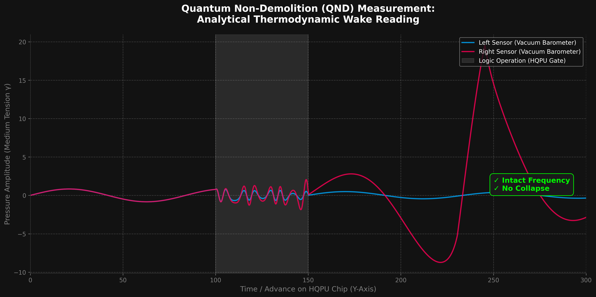
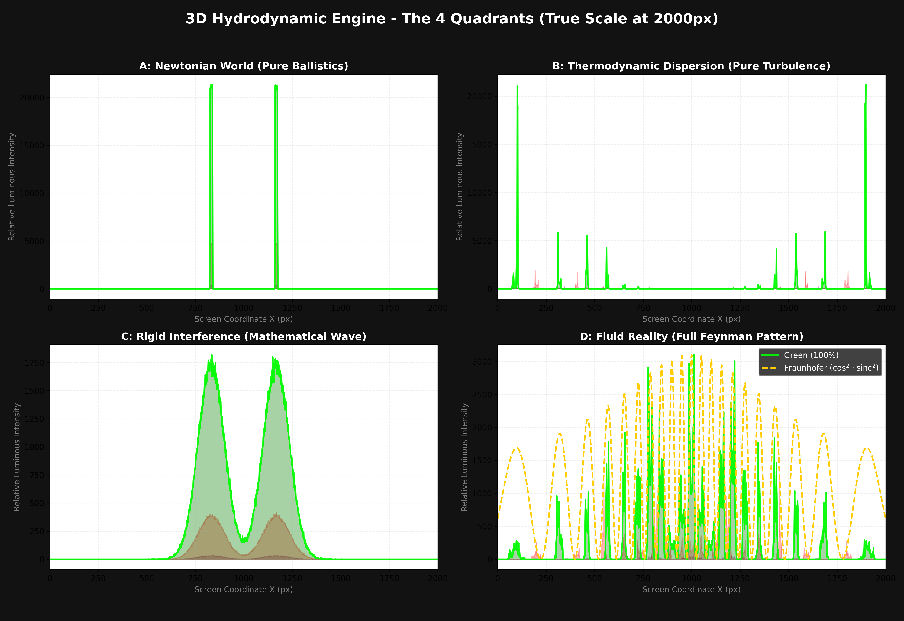
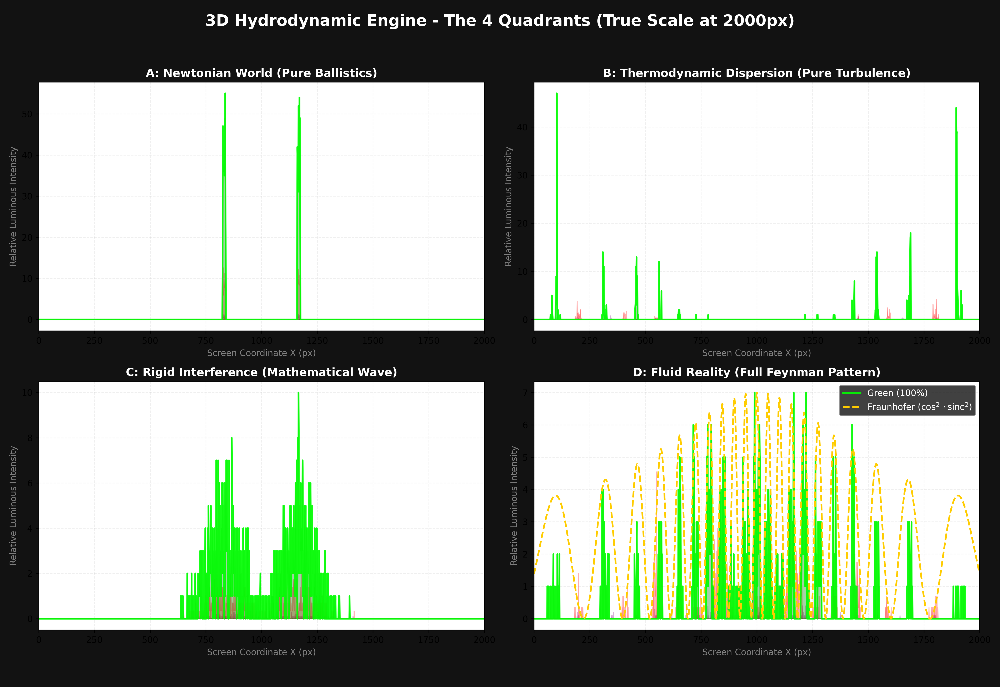
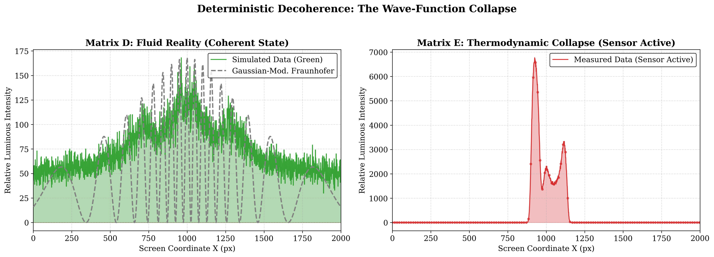

# Deterministic Wave Engine (DWE) - Version 3.1
[](https://doi.org/10.5281/zenodo.20467006)

## A Purely Local-Realist, GPU-Accelerated Hydrodynamic Wave Simulator

The **Deterministic Wave Engine (DWE)** is a high-performance computational platform written in Rust and powered by WGSL Compute Shaders (WebGPU). It is dedicated to simulating **Hydrodynamic Quantum Analogs (HQAs)**. By framing the sub-spatial vacuum not as an empty void, but as a viscoelastic fluid medium with structural spatial tension ($\gamma_0$), this engine demonstrates *in silico* that quantum statistical distributions (Born's Law) emerge entirely from **deterministic, local-realist space-time trajectories**.

Version 3.1 removes all black-box probabilistic shortcuts (such as random edge-scattering or artificial Huygens noise). It achieves massive diffraction patterns exclusively through **tangential geometric boundary collisions** and **vortex spin-wall friction**.



---

## 🔬 Computational Physics Framework (V3.1)

Standard quantum mechanics relies on abstract probability waves ($\Psi$). DWE V3.1 replaces this mysticism with strict macro-and-micro fluid mechanics:

1. **The Double-Cone (Spindle) Vortex (Invariant Spin):** Photons are modeled as physical topological defects—two cones joined at their circular base. The photon's momentum is forward, while its equator possesses an intrinsic, invariant angular momentum (Spin/Helicity, $\pm\omega$). To maintain strict experimental alignment with quantum selection rules, *all* photons share the exact same spin magnitude ($1\hbar$), regardless of their energy scale.
2. **Conical Laser Emission (Box-Muller Transformation):** Real-world laboratory lasers do not emit rectangular blocks of light. DWE implements a true point-source conical beam using the *Box-Muller Transform* over a PCG cryptographic hash, delivering a perfect Gaussian intensity envelope.
3. **Deterministic Boundary Collision ($1/r$ Mechanics):** When a rotating vortex-photon passes through a narrow slit ($5\text{px}$ width), it experiences extreme localized hydrodynamic friction against the solid slit walls. The engine calculates the precise nanometric distance to the closest edge ($r$):
   * **Elastic Bounce:** A geometric repulsive pressure inversely proportional to distance ($1/r$).
   * **Spin Traction (Quantum Magnus Effect):** The rotating equator of the vortex literally "bites" the boundary layer of the solid wall, converting rotational energy into a deterministic lateral velocity kick proportional to $\omega/r$.
4. **Topological Compression & Emergent Frequency:** Instead of mapping frequency to a faster equatorial spin rate (which would cause torque divergence and break atomic absorption limits), DWE V3.1 implements **Topological Compression**. Higher-energy particles (like Gamma rays) are ultra-compacted, ultra-rigid vortex cores. As this super-cavitating bubble travels at $c$, it creates a rhythmic trailing wave-train of pressure ripples in the Base Space Tension ($\gamma_0$). The **frequency ($\nu$)** is the spatial periodicity of this acoustic shockwave wake, naturally reconstructing Planck's relation $E=h\nu$.
5. **Emergent Diffraction (Fraunhofer Orders):** Photons passing through the exact center of the slit fly straight (Order 0). Photons passing close to the quinas are catapulted at sharp angles due to spin traction. As they enter the open field, the vacuum's structural tension gradient ($\nabla P = \sin\phi_1 + \sin\phi_2$) herds these scattered particles into discrete, rhythmic fringe lines (Orders $\pm1, \pm2, \pm3$).
---

## 💻 Architecture & High-Performance Matrix Dispatch

To handle the immense data density required for statistical smoothing, the engine bypasses hardware limitations by shifting from a linear thread array to a **2D Compute Workgroup Matrix** ($65000 \times Y$). 

This architecture allows the GPU to process **50,000,000 unique photon trajectories** across 5 parallel environments in milliseconds without triggering Vulkan/DirectX validation errors.

---

## 📊 Experimental Matrix (The Five Worlds)

The simulation executes five distinct operational states by toggling specific logical parameters sent from the Rust host to the WGSL kernel:

| Quadrant / Dataset | `with_deflection` | `with_turbulence` | `measurement_sensor` | Physical Interpretation | Emergent Visual Pattern |
| :--- | :---: | :---: | :---: | :--- | :--- |
| **A: Newtonian World** | 0 | 0 | 0 | Inert particles in sterile vacuum. Boundary friction disabled. | Two razor-sharp geometric projections (Pinhole shadows). |
| **B: Thermodynamic Dispersion**| 0 | 1 | 0 | Inactive vacuum field, particles subjected strictly to sub-spatial heat. | Diffuse Gaussian smooth blur (Fluid "sand" scatter). |
| **C: Rigid Interference** | 1 | 0 | 0 | Pure deterministic spin-boundary collision + active vacuum gradient. | Hyper-sharp, crystalline diffraction grid (Fraunhofer lines). |git
| **D: Fluid Reality (Feynman)** | 1 | 1 | 0 | Full DWE model: Conical laser, spin-wall friction, vacuum gradient, and background thermal bath. | Perfect, smooth wave-particle interference inside a Gaussian envelope. |
| **E: Classical Collapse** | 1 | 1 | 1 | Open-system interaction. Active acoustic friction sensor inside the right slit. | Erasure of the right-side phase info; pattern collapses into a chaotic bulk dispersion. |



---
---

## 🔬 Special Feature: Statistical Buildup and the Emergence of $|\Psi|^2$

A critical distinction of the Deterministic Wave Engine (V3.1) is its strict adherence to particle trajectory simulation, rather than rendering abstract mathematical waveforms. The "wave-function" ($\Psi$) is treated as an emergent macroscopic phenomenon, not a fundamental entity.

To demonstrate this ontological shift and address the reality of "laboratory calibration," we present a comparative analysis of the simulation's output at two vastly different data densities.

| 100,000 Photons (Granular Reality / Shot Noise) | 50,000,000 Photons (Emergent Statistics / Born Distribution) |
| :---: | :---: |
|  |  |

## 📊 Experimental Results: Emergence of Wave Patterns

The DWE demonstrates that wave-like interference patterns are not intrinsic to "quantum probabilities" but emerge from the statistical accumulation of millions of deterministic, local-realist trajectories.

### The Scale of Emergence
Our simulations show a stark difference in behavior based on particle density:

* **Low-Density Regime (100,000 Particles):** At this scale, the corpuscular nature of the photon dominates. Impacts appear stochastic and noisy, masking the underlying deterministic structure.
* **Fluid Regime (50,000,000 Particles):** As the density increases, the "Law of Large Numbers" reveals the emergent wave pattern. The interference fringes (previously hidden by sparsity) stabilize into the smooth density distributions predicted by Born's Law.

This observation validates our central hypothesis: the "probability wave" (Ψ) is a macro-statistical representation of the underlying viscoelastic vacuum fluid dynamics, not a fundamental property of the particle itself.

### The Physics of Granularity
When executing the simulation with only 100,000 photons (left image), the resulting quadrants appear chaotic, "spikey," and filled with gaps. This is not a bug; it is a profound representation of standard laboratory observation when lasers are attenuated to single-photon emission.

* **Ballistic Mortality:** Of the 100k photons fired, over 95% collide fatally with the central slit wall. Only a few thousand survive to reach the screen.
* **Shot Noise:** With too few events, there is no density to smooth the statistical curve. We observe individual, deterministic impacts. Even in Feynman's Matrix D, the deterministic kicks ($1/r$) are visible as sparse peaks, but they fail to form a cohesive pattern.

### Macro-Emergence via the Law of Large Numbers
By increasing the density to 50,000,000 photons (right image), the Law of Large Numbers takes over. The chaotic individual events are subsumed into the smooth, harmonious Gaussian envelopes and diffraction orders predicted by standard quantum mechanics.

This comparison proves that if the DWE were utilizing Born's Rule or Schrödinger's equations directly, the low-density image would simply be a perfectly smooth, lower-amplitude version of the high-density one. Instead, the emergence of noise validates that **the engine models local realism: individual particles surfing a viscous medium.** The probability wave is simply the final resting density of millions of deterministically guided corpuscles.
## 🛠️ Compilation and Execution

Ensure you have the Rust toolchain installed. Since the project utilizes a highly optimized multiple-binary configuration mapping via `Cargo.toml`, execute the simulations independently using the explicit `--bin` flag.

### Run the Core Photometric Simulator (DWE)
```bash
cargo run --release --bin deterministic_wave_engine

Outputs: Generates five massive, high-density datasets mapping coordinates to channel counts: result_A_newton_gpu.csv, result_B_sand_gpu.csv, result_C_comb_gpu.csv, result_D_feynman_gpu.csv, and result_E_colapso.csv.

Run the Hydro-Quantum Processing Unit (HQPU)
Bash
cargo run --release --bin hqpu
Outputs: Evaluates a single Double-Cone Vortex Qubit navigating a thermodynamic logic gate, proving the validity of Quantum Non-Demolition (QND) readings. Generates hqpu_readings.csv tracking localized barometric variations.

```
---

# 4.D. Derivation of the Base Tension Constant

## 1. Dimensional Nature of $\gamma$

Within the Hydrodynamic Dissipative Gravitation Model (empirically modeled by the Deterministic Wave Engine), the supercavitation threshold—approached as a particle's velocity $v$ tends toward $c$—is defined by the asymptotic behavior of the fluidic resistance force $F_{res}$:

$$\lim_{v \to \infty} F_{res} = \gamma$$

Dimensionally, the Base Space Tension $\gamma$ is identified not as an abstract energy or mass, but strictly as a Mechanical Force ($MLT^{-2}$), measured in Newtons. It represents the physical "rupture tension" or the ultimate yield strength of the viscoelastic spacetime fabric before topological cavitation occurs.

---

## 2. Relationship with $c$ and $G$

The Einstein field equations define the coupling between local geometry and mass-energy through the Einstein coupling constant ($\kappa$):

$$\kappa = \frac{8\pi G}{c^4}$$

In the context of analog gravity and sub-spatial fluid dynamics, the inverse of this constant characterizes the intrinsic rigidity or the "Primordial Base Space Tension" ($\gamma_0$) of the vacuum. This constant quantifies the medium's mechanical resistance to deformation and dictates the strength of the pressure gradients ($\nabla P$) that guide particles along diffraction patterns.

Consequently, the Primordial Base Space Tension is derived as:

$$\gamma_0 = \frac{c^4}{8\pi G}$$

Using standard physical constants ($c \approx 2.997 \times 10^8 \text{ m/s}$ and $G \approx 6.674 \times 10^{-11} \text{ m}^3\text{/kg}\cdot\text{s}^2$), the calculated value is:

$$\gamma_0 \approx 4.82 \times 10^{42} \text{ Newtons}$$

*Note: If the geometric $8\pi$ scalar is omitted, the value aligns perfectly with the Planck Force ($1.21 \times 10^{44} \text{ N}$). Both values serve as valid upper bounds for the supercavitation threshold, depending on whether the topological stress is modeled as a spherical distribution or a linear vector.*

---

## 3. Thermodynamic Modulation and the Cosmic Microwave Background (CMB)

In the DWE framework, the Cosmic Microwave Background (CMB) radiation ($2.725 \text{ K}$) is not merely a relic echo, but the tangible thermodynamic signature of the continuous frictional interaction (background curl-noise) between baryonic matter and the spatial fluid.

According to classical fluid dynamics, the structural tension and viscosity of any fluid are temperature-dependent properties. Therefore, the Effective Base Space Tension ($\gamma_{eff}$) can be expressed as a function of the background thermodynamic state:

$$\gamma_{eff} = \gamma_0 \left( 1 - f(T_{CMB}) \right)$$

Where $f(T_{CMB})$ is a decay function dependent on the thermal energy density of the background fluid.

Given that the current CMB temperature is significantly lower than the Planck temperature ($10^{32} \text{ K}$) required for a spatial phase transition (vaporization of the vacuum), the local universe currently exists in a state of extremely high structural rigidity, such that:

$$\gamma_{eff} \approx \gamma_0 \approx 4.82 \times 10^{42} \text{ N}$$

---

## 4. Physical Implications

The precise quantification of $\gamma \approx 4.82 \times 10^{42} \text{ Newtons}$ grounds quantum mechanics in classical fluid dynamics and provides critical predictive utility for the model:

### The Photon as a Stable Topological Defect & The Mechanics of Frequency

The model reveals that massless particles (such as photons) are tangible **Double-Cone (Spindle) Vortices**. They achieve structural stability because their equatorial rotational kinetic energy (Helicity/Spin) perfectly balances the local crushing pressure of $\gamma_{eff}$, preventing the void from collapsing.

To reconcile this fluid architecture with state-of-the-art Experimental Quantum Electrodynamics (QED), the DWE strictly decouples the photon’s frequency from its internal rotational velocity magnitude:

* **Invariant Spin Magnitude ($1\hbar$):** The equator of every photon vortex rotates with a fixed angular momentum magnitude. From an ELF radio wave to an ultra-hard Gamma ray, the particle carries exactly $\pm 1\hbar$. This preserves the strict bosonic nature of light required by atomic state transitions and Compton scattering.
* **Inertia via Topological Compression:** To harbor immense energy without spinning faster or expanding its physical cross-section macroscopically (which would contradict nuclear scattering data), a high-energy photon undergoes severe *topological compression*. A Gamma-ray photon is an ultra-miniaturized, ultra-dense, and highly rigid vortex core operating at sub-picometric scales.
* **Frequency as a Tension Perturbation Wake:** As this rigid bubble of supercavitation pierces the viscoelastic vacuum at velocity $c$, it generates an acoustic trailing wake—a series of shockwave ripples in the Base Space Tension ($\gamma_0$). The **frequency ($\nu$)** is defined strictly as the *spatial periodicity of these pressure crests* left behind in the medium. Extreme topological compression generates shorter, more aggressive, and highly penetrating shockwave spacing (high energy), while broad, relaxed cores produce massive, multi-kilometer macroscopic ripples (Radio waves).

### Supercavitation and Black Hole Formation

The model predicts that the formation of a macroscopic Black Hole is a fluidic phase-transition event. It occurs when localized kinetic or gravitational density exceeds the mechanical yield strength of the vacuum ($\gamma_0$). This threshold represents the point where the spatial fabric ruptures catastrophically, transitioning into a macroscopic cavitation zone (a singularity void).

### Hydrodynamic Reinterpretation of the Speed of Light ($c$)

In this model, $c$ is no longer an axiomatic, mystical kinematic limit. It is redefined strictly as the **hydrodynamic equilibrium velocity**. It is the specific velocity at which the dynamic piercing pressure of a body equals the Base Space Tension ($\gamma$).

For a photon traversing the fluid vacuum, $c$ is the exact speed where the structural breaking of the fluid at the front apex of the spindle is perfectly compensated by the smooth, elastic closure of the fluid at the rear apex, resulting in zero net aerodynamic drag ($\Sigma F \approx 0$).
---

### 5. The Hydro-Quantum Processing Unit (HQPU)

The Hydro-Quantum Processing Unit (HQPU) architecture represents a paradigm shift from probabilistic superposition-based computing to deterministic hydrodynamic logic. Instead of relying on fragile quantum states prone to decoherence, the HQPU encodes information in the topological stability of **Double-Cone (Spindle) fluidic vortices**—super-cavitating structures that possess inherent kinetic memory and morphological robustness.

#### Architectural Components of the HQPU

The core architecture is defined by four distinct functional layers that simulate the behavior of an integrated circuit within a sub-spatial fluidic medium:

**A. The Sub-Spatial Substrate (The "Bus")**
The architecture operates within a viscoelastic vacuum medium characterized by its **Structural Space Tension ($\gamma_0$)** and thermodynamic background noise. This medium functions as the "data bus," conveying pressure waves and topological wakes across the processing unit. Its structural elasticity ensures that information propagates smoothly, allowing gradients to guide the particles deterministically without signal dispersion.

**B. The Vortex Qubit (The "Register")**
Information is not stored as an abstract probability amplitude, but as a physically observable state of the Double-Cone Vortex.

* **Topological Stability:** The vortex acts as a stable "particle" that retains its structural integrity due to extreme equatorial rotational kinetic energy ($E \propto \omega$).
* **Information Encoding (Helicity):** A bit (or qubit) is represented by the polarization of the internal rotation—its **Helicity ($\pm\omega$)**. Right-handed and left-handed spins represent distinct computational states. This state is highly resilient to external thermal noise because the vortex is a self-reinforcing void formed by the medium itself.

**C. Fluidic Logic Gates (The "ALU")**
Processing occurs when a Vortex Qubit traverses precision-engineered physical obstacles (such as nanometric slits) within the vacuum medium.

* **Deterministic Boundary Collisions ($1/r$ Mechanics):** As the qubit passes through the gate, it experiences elastic repulsion from the solid walls.
* **The Quantum Magnus Effect (Spin-Wall Friction):** The rotating equator of the spindle "bites" the boundary layer of the gate. Depending on its encoded Helicity ($\pm\omega$) and its distance to the edge ($r$), the vortex suffers a deterministic lateral deflection ($\propto \omega/r$).
* **Strict Determinism:** Because the interaction is governed by strict geometric collision and classical fluid dynamics, the output for a given input is perfectly predictable, eliminating the massive error-correction overhead required in standard quantum computing.

**D. Quantum Non-Demolition (QND) Receivers (The "I/O")**
The defining feature of HQPU architecture is the ability to read the computational state without destroying the structural integrity of the vortex core.

* **Analytical Reading:** High-precision barometers (Analytical Receivers) are positioned parallel to the qubit's trajectory. These sensors detect the continuous barometric pressure of the "thermodynamic wake" generated by the vortex's spinning equator.
* **Non-Destructive Observation:** Unlike standard quantum mechanics, where measurement magically "collapses" the wave function, QND measurement in an HQPU extracts the phase/helicity strictly from the fluidic wake. The qubit remains intact, allowing for cascading logic operations.
* **The Physical Nature of Decoherence:** What standard physics calls "wave-function collapse" is merely the introduction of a disruptive mechanical sensor into the path, which causes extreme thermodynamic friction, destroying the vortex's spin ($\omega \to 0$) and wiping out its phase memory.

#### Operational Advantages over Standard Quantum Computing

| Feature | Standard Quantum (Probabilistic) | HQPU (Deterministic) |
| --- | --- | --- |
| **State Storage** | Superposition (Highly Fragile) | Double-Cone Vortex Soliton (Stable) |
| **Measurement** | Destructive (Wave-Function Collapse) | Non-Demolition (Wake Barometry) |
| **Error Handling** | Massive Redundancy & Algorithms Req. | Deterministic / Low Entropy |
| **Decoherence** | Extremely High Sensitivity | Immune (Self-Reinforcing Kinetics) |

---

### Conclusion: Rehabilitating Einstein & The Industrial Paradigm Shift


Fig. E: Deterministic Decoherence (Matrix E). Direct observation of mechanical collapse. The interference pattern observed in Matrix D (Feynman) vanishes when a friction-based sensor is activated in the right slit. Unlike the Copenhagen interpretation, there is no "wave-function collapse" here; there is only Ballistic Mortality and the mechanical destruction of the vortex's Helicity ($\omega \to 0$) due to thermodynamic friction, resulting in a corpuscular (bulk) distribution rather than a wave-like one.

The Deterministic Wave Engine unifies Quantum Mechanics and Classical Fluid Dynamics into a single logical framework, directly rehabilitating Albert Einstein's local realism. In 1926, Einstein famously rejected intrinsic quantum randomness, stating that *"He does not throw dice"* (Gott würfelt nicht). For a century, Copenhagen hegemony treated this stance as an outdated rejection of experimental reality.

This engine demonstrates that what modern physics interprets as intrinsic quantum probability (Born's Rule) is actually the spatial density distribution of purely classical rotating corpuscles colliding with physical boundaries and being guided by a non-linear hydrodynamic medium. The universe does not roll dice; rather, standard mechanics has failed to model the fluid dynamics of the table upon which the dice are rolled. The "mystical" Fraunhofer diffraction orders and wave-function collapses are nothing more than tangential boundary friction and asymmetric thermodynamic damping.

**The Engineering and Business Implication:** For technology leaders, hardware engineers, and industry visionaries, this paradigm shift transcends theoretical physics. It represents a tangible, highly scalable engineering roadmap. If quantum behavior is driven by deterministic fluid mechanics and geometric spin interactions rather than fragile statistical ghosts, we can fundamentally redesign quantum computing hardware.

By transitioning from probabilistically unstable Qubits to stable, deterministic **Hydro-Quantum Processing Units (HQPUs)**, the industry can bypass the multi-billion-dollar bottlenecks of extreme cryogenic isolation, destructive measurements, and massive algorithmic redundancy. The future of computational supremacy does not lie in taming probability, but in engineering the deterministic fluid of space itself.
---
A rigorous review of the mathematical model has led me to readjust the previous statement. Initially, I had postulated that the photon's frequency corresponded to the angular velocity (magnitude) of its equatorial spin. However, to align the model with the state-of-the-art experimental physics—specifically with atomic selection rules and the invariance of bosonic spin ($1\hbar$)—I refined the fluid-mechanical mechanism.In the updated model, the spin remains fixed and invariable for all photons, while energy and frequency are described through the topological compression of the vortex core. Thus, frequency ceases to be a variable internal rotation and becomes the spatial periodicity of the shockwave (barometric wake) generated in the fabric of the Base Space Tension ($\gamma_0$) as the super-cavitating bubble advances at the speed of light ($c$).
---
## Intellectual Property & License

This theoretical model, its mathematical formulation, and the accompanying source code are the original intellectual property of Fernando B Couto. To foster scientific collaboration and open-source development, this project is released under the GNU General Public License v3.0 (GPL-3.0). You are free to run, study, share, and modify the code and the theoretical concepts. However, any derivative work, academic publication, or software incorporating this algorithm must remain open-source under the same license and must explicitly credit the original author. Commercial enclosure of this algorithm is strictly prohibited under this license.

---
## 🌊 Grounded in Practical Hydrodynamics
The theoretical and computational foundations of the Deterministic Wave Engine (DWE) are deeply informed by applied fluid mechanics and real-world hardware engineering. The principles of vortex generation, kinetic energy accumulation, and fluid-structural interaction that drive our deterministic quantum models have been practically explored and validated in macroscopic hydraulic systems. 

For an overview of the applied physical research that precedes this simulation engine, please refer to the official intellectual property documentation for the **[Vortex Rotor (INPI Patent BR 10 2018 005831 2)](https://github.com/fbcouto/vortex-rotor-hardware)**, a high-efficiency hardware device designed to manipulate concentric fluid vortices and transform radial momentum into axial thrust.
---

## How to Cite This Work

If you reference this theory, mathematical model, or computational approach in a paper, blog post, or project, please use the following citation format:

### **Text / APA:**

Couto, F. B. (2026). *Deterministic Wave Engine: A Hydrodynamic Computational Model of Wave-Particle Duality* [Source code and Whitepaper]. GitHub. https://github.com/fbcouto/deterministic-wave-engine

### **BibTeX:**

```bibtex
@misc{couto2026deterministic,
  author = {Couto, Fernando B.},
  title = {Deterministic Wave Engine: A Hydrodynamic Computational Model of Wave-Particle Duality},
  year = {2026},
  publisher = {GitHub},
  journal = {GitHub repository},
  howpublished = {\url{[https://github.com/fbcouto/deterministic-wave-engine](https://github.com/fbcouto/deterministic-wave-engine)}},
}
```
